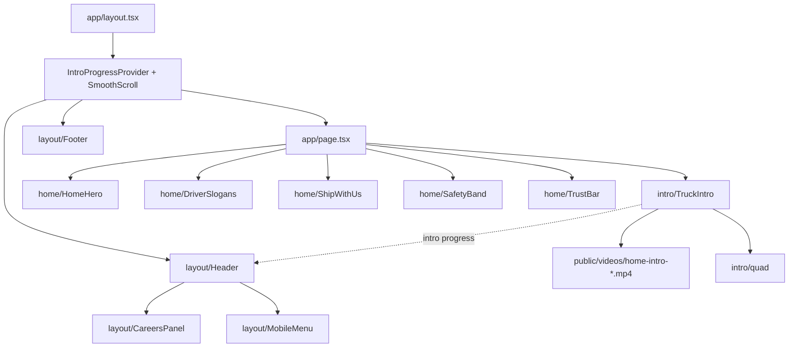

# NAVIGATION.md
> Map of the project: task → file, and every component in the library. Look here before searching the repo cold.

## Pages
| Route | File | Status |
|---|---|---|
| `/` | `app/page.tsx` | 6-second video truck intro, full-screen photo hero with the fixed h1, numbers band, Ship with us band, safety band, rolling slogan line and three apply cards built |
| `/services` | `app/services/page.tsx` | Placeholder |
| `/quote` | `app/quote/page.tsx` | State map + quote form built; sends to a stub until the backend exists |
| `/fleet-map` | `app/fleet-map/page.tsx` | Placeholder (Fleet Map — formerly Track a Load) |
| `/news` | `app/news/page.tsx` | Placeholder |
| `/careers/drivers` | `app/careers/drivers/page.tsx` | Placeholder |
| `/careers/staff` | `app/careers/staff/page.tsx` | Placeholder |
| `/about` | `app/about/page.tsx` | Story section built (draft copy); team, fleet and safety still to come |

## Common tasks
| I need to... | Go to |
|---|---|
| Change a nav link or the company name | `lib/site.ts` — Header, mobile menu and Footer all read from it |
| Change brand colors or the animation easing | `app/globals.css` → `@theme` (keep ARCHITECTURE.md in sync) |
| Change the font | `app/layout.tsx` → `Manrope` import |
| Change page titles / SEO description | `app/layout.tsx` → `metadata`, or `metadata` in each page file |
| Tune intro timing (length, how fast skipping is, when the white fade, the logo appearing and the glide happen) | `components/intro/timeline.ts` |
| Replace the intro video | `public/videos/home-intro-1080.mp4`, `-720.mp4`, `-poster.jpg` |
| Change the logo's size or spot in the middle of the screen | `components/intro/TruckIntro.tsx` → `centerSpot`, `APPEAR_SCALE` |
| Change how the logo flies into the header | `components/intro/TruckIntro.tsx` → `draw` |
| Fix the intro hanging, or how it keeps time with the video | `components/intro/clock.ts` → `advanceClock` |
| Change the Ship with us band (copy, photo, the angled edge) | `components/home/ShipWithUs.tsx`; photo is `public/images/home-hero-sierra.jpg` (swapped with the hero 2026-09-21; the hero's is now `safety-truck-front.jpg`) |
| Change the safety band (GPS, dash cams, maintenance) | Copy: `lib/site.ts` → `safetySystems`; layout: `components/home/SafetyBand.tsx`; photo is `public/images/ship-truck-side.jpg`; each row's hover clip is its `video` in `safetySystems` (placeholders in `public/videos/safety-*-placeholder.mp4`) |
| Edit the homepage headline (h1) | `lib/site.ts` → `homeHeadline`; layout in `components/home/HomeHero.tsx` |
| Change the hero photo, its crop, its lede line or its two numbers | `components/home/HomeHero.tsx` (photo `public/images/home-hero-desert.jpg`, `object-position`, the white wash); the lede and numbers are `lib/site.ts` → `homeLede`, `heroStats` |
| Change the three homepage apply cards (roles, copy, photos, where they link) | `lib/site.ts` → `applyRoutes`; layout in `components/home/ApplyRoutes.tsx`; photos in `public/images/apply-*.jpg` |
| Bring back the full-width homepage photo band, or add the B-roll video | `components/ui/HeroMedia.tsx` is still there but unused since 2026-09-17 — the apply cards took its place in `app/page.tsx` |
| Replace the draft company history (homepage card + About page) | `lib/story.ts` |
| Change the homepage numbers (years, miles, loads, states) | `lib/site.ts` → `companyStats`; layout in `components/home/TrustBar.tsx` |
| Change quote form fields, error messages or the thank-you screen | `components/quote/QuoteForm.tsx` |
| Change the quote map's colors, hover lift, route line or pins | `components/quote/StateMap.tsx` |
| Connect the quote form to the backend | `lib/forms.ts` → `submitQuote` (keep `QuoteRequest` in sync) |
| Regenerate or re-project the state shapes | `scripts/build-us-states.mjs` → writes `lib/us-states.ts` |
| Fix a ZIP that lights up the wrong state | `lib/zip.ts` |
| Change the shared input/select look | `components/ui/Field.tsx` → `controlClass` |
| Change header behavior (hide on scroll on phones, dimmed state during the intro, Careers drop panel) | `components/layout/Header.tsx`, `components/layout/CareersPanel.tsx` |
| Change the phone/tablet menu | `components/layout/MobileMenu.tsx` |
| Change the footer | `components/layout/Footer.tsx` |
| Add or change a button style | `components/ui/Button.tsx` |
| Fade a block in when it scrolls into view | Wrap it in `<Reveal>` from `components/ui` |
| Slide a photo and its text in from opposite sides, landing together | Make the section a `<SlideGroup>` and wrap each piece in `<SlideItem from="left" \| "right">` (`components/ui/SlideIn.tsx`); used by Ship with us and the safety band |
| Change or reorder the homepage's rolling slogans | `lib/site.ts` → `driverSlogans` — `{ lead, tail }` pairs (ink over grey), the smaller driver line between the safety band and the apply cards (`components/home/DriverSlogans.tsx`). The first one is what screen readers get; keep every lead and tail a similar length |
| Start a new page | Copy a placeholder in `app/`, then add its link in `lib/site.ts` (check DECISIONS.md nav rules first) |
| Check whether something is in scope | `docs/DECISIONS.md` |
| Find the original logo files | `docs/Logo black.svg` (full logo), `docs/Only logo Solutions.svg` (icon only) |
| Run the site locally | `npm run dev` → http://localhost:3000 |

## How the homepage fits together


## Component library
Import from the folder, e.g. `import { Button, Container } from "@/components/ui"`.

| Folder | Component | What it does | Runs on |
|---|---|---|---|
| `ui/` | `Button` | Pill button; `href` makes it a link. Variants: `primary` (solid black), `apply` (black, orange on hover — Apply To Drive only), `outline` (black ring on a light frosted fill). Both share one type size so a pair sized alike matches. Sizes: `md`, `lg` | Server |
| `ui/` | `Container` | Centered max-width wrapper with side padding | Server |
| `ui/` | `Logo` | Brand logo, `variant="full"` or `"icon"`; fills its wrapper's width | Server |
| `ui/` | `Reveal` | Fades + lifts children in once they scroll into view; `delay` for stagger | Client |
| `ui/` | `SlideGroup`, `SlideItem` | A section that slides its items in from the sides on one shared trigger, so they start and stop together; `distance="100%"` starts an item fully off the screen edge. Clips sideways overflow | Client |
| `ui/` | `HeroMedia` | Full-width photo or looping video band, 500px tall; shown straight with no overlay; `image` now, optional `video` later. **Not currently used** — the homepage apply cards replaced it on 2026-09-17; kept for other pages' heroes | Server |
| `ui/` | `CountUp` | Number that fills up from zero once it scrolls into view; `suffix` for "+" / "M+" | Client |
| `ui/` | `RotatingSlogan` | Rolls through `driverSlogans` like an odometer; `as` picks the tag (the homepage uses the default `p`); pauses on hover/focus and in a background tab; static under reduced motion | Client |
| `ui/` | `Field`, `controlClass`, `errorId` | Form field label + error message, and the shared input/select look | Server |
| `ui/` | `PagePlaceholder` | Temporary body for pages not built yet | Server |
| `layout/` | `Header` | Fixed header with no bar: logo alone top-left, glass nav pill in the middle with a black pill on the current page that glides to the new item on navigation, Get a Quote (outline) / Apply To Drive (black) as a same-width pair on the right; Careers drop panel, hide-on-scroll on phones | Client |
| `layout/` | `CareersPanel` | Glass panel that drops from under the nav pill with the two Careers links | Client |
| `layout/` | `MobileMenu`, `MenuToggle` | Full-screen menu below `lg` and its two-line → X button | Client |
| `layout/` | `Footer` | Logo, footer links, copyright | Server |
| `home/` | `HomeHero` | Full-screen photo hero under a white wash from the left: fixed h1, Apply to drive + Get a quote up top; lede and two numbers along the bottom. The wash runs top-to-bottom below `lg` | Server |
| `home/` | `DriverSlogans` | The rolling slogans as a smaller line under the safety band, above the apply cards | Server |
| `home/` | `ApplyRoutes` | The three flat apply cards (Driver / Dispatcher / Tire shop) from `applyRoutes`; photo, role and one line, whole card is one link and one tab stop; near-square photos from `md` up | Server |
| `home/` | `ShipWithUs` | The shipper band: the logo truck left with an angled right edge, running to the screen edge from `lg`, text right (swapped 2026-09-19 to zigzag off the hero). Replaced `AudienceSplit` / `AudiencePanel` on 2026-09-18 | Server |
| `home/` | `SafetyBand` | GPS, dash cams and maintenance records: Ship with us mirrored — text and a hairline list left, photo right with an angled left edge; hovering a row swaps the photo for that row's clip, on white; it follows Ship with us directly | Client (hover state) |
| `home/` | `TrustBar` | Company numbers that fill up on scroll, set under a hairline with no box (`companyStats` in `lib/site.ts`); 2×2 on phones, one row from `lg` | Server |
| `quote/` | `QuoteForm` | Get a Quote: map + form kept in sync, browser-side checks, thank-you screen | Client |
| `quote/` | `StateMap` | Lower-48 map: hover lift + name tag, click pickup then delivery, route line and pins | Client |
| `intro/` | `TruckIntro` | Plays the intro over the top of the page on load: the video, the logo handoff, white fade, Skip intro button, skip on scroll/tap | Client |
| `intro/` | `timeline.ts` | `INTRO` play length, skip speed and phases + easing helpers | — |
| `intro/` | `clock.ts` | Advances the intro clock: follows the video, then real time once the picture has run out | — |
| `intro/` | `quad.ts` | Four corners → CSS `matrix3d`, and the corner helpers the glide into the header interpolates | — |
| `providers/` | `IntroProgressProvider`, `useIntroProgress` | Shares intro progress (0–1) between intro and header | Client |
| `providers/` | `SmoothScroll` | Lenis smooth scrolling; off for reduced motion | Client |

## Directory map
```
app/          → routes, one folder per page (App Router), globals.css, icon.svg
components/   → the component library (ui, layout, home, about, quote, intro, providers)
lib/          → site config (names + links), story copy, quote types + stub, state shapes, ZIP lookup
scripts/      → one-off generators (state shapes for the quote map)
public/       → logo.svg, logo-icon.svg
docs/         → project docs + original logo files
```
