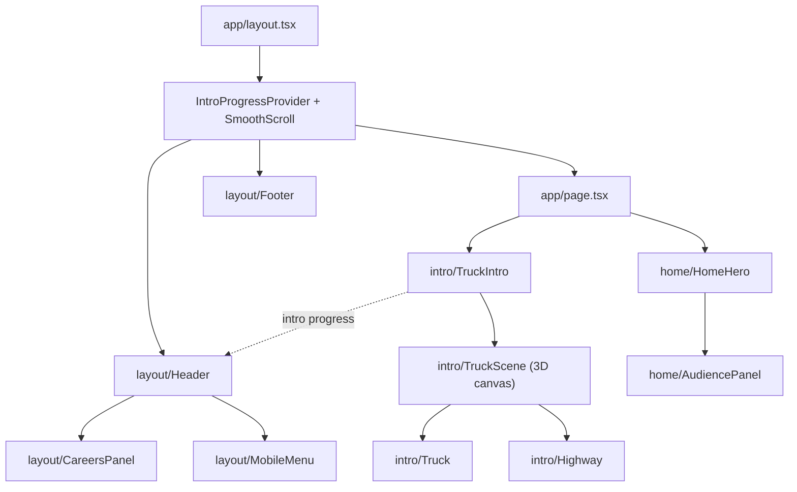

# NAVIGATION.md
> Map of the project: task → file, and every component in the library. Look here before searching the repo cold.

## Pages
| Route | File | Status |
|---|---|---|
| `/` | `app/page.tsx` | Scroll intro + "Ship With Us / Drive For Us" panels built |
| `/services` | `app/services/page.tsx` | Placeholder |
| `/quote` | `app/quote/page.tsx` | Placeholder |
| `/track` | `app/track/page.tsx` | Placeholder |
| `/careers/drivers` | `app/careers/drivers/page.tsx` | Placeholder |
| `/careers/staff` | `app/careers/staff/page.tsx` | Placeholder |
| `/about` | `app/about/page.tsx` | Placeholder |

## Common tasks
| I need to... | Go to |
|---|---|
| Change a nav link or the company name | `lib/site.ts` — Header, mobile menu and Footer all read from it |
| Change brand colors or the animation easing | `app/globals.css` → `@theme` (keep ARCHITECTURE.md in sync) |
| Change the font | `app/layout.tsx` → `Manrope` import |
| Change page titles / SEO description | `app/layout.tsx` → `metadata`, or `metadata` in each page file |
| Tune intro timing (length, when the white fade and logo glide happen) | `components/intro/timeline.ts` |
| Tune the intro camera path | `components/intro/TruckScene.tsx` → `Director` |
| Change the truck's look or logo placement | `components/intro/Truck.tsx` |
| Change the road, guardrail, light poles | `components/intro/Highway.tsx` |
| Change how the logo flies into the header | `components/intro/TruckIntro.tsx` → `handleFrame` |
| Edit the homepage headline and panels | `components/home/HomeHero.tsx` |
| Change header behavior (hide on scroll, Careers drop panel) | `components/layout/Header.tsx`, `components/layout/CareersPanel.tsx` |
| Change the phone/tablet menu | `components/layout/MobileMenu.tsx` |
| Change the footer | `components/layout/Footer.tsx` |
| Add or change a button style | `components/ui/Button.tsx` |
| Fade a block in when it scrolls into view | Wrap it in `<Reveal>` from `components/ui` |
| Start a new page | Copy a placeholder in `app/`, then add its link in `lib/site.ts` (check DECISIONS.md nav rules first) |
| Check whether something is in scope | `docs/DECISIONS.md` |
| Find the original logo files | `docs/Logo black.svg` (full logo), `docs/Only logo Solutions.svg` (icon only) |
| Run the site locally | `npm run dev` → http://localhost:3000 |

## How the homepage fits together


## Component library
Import from the folder, e.g. `import { Button, Container } from "@/components/ui"`.

| Folder | Component | What it does | Runs on |
|---|---|---|---|
| `ui/` | `Button` | Pill button; `href` makes it a link. Variants: `primary` (orange), `dark`, `outline`. Sizes: `md`, `lg` | Server |
| `ui/` | `Container` | Centered max-width wrapper with side padding | Server |
| `ui/` | `Logo` | Brand logo, `variant="full"` or `"icon"`; fills its wrapper's width | Server |
| `ui/` | `Reveal` | Fades + lifts children in once they scroll into view; `delay` for stagger | Client |
| `ui/` | `PagePlaceholder` | Temporary body for pages not built yet | Server |
| `layout/` | `Header` | Fixed header: logo, nav, Careers drop panel, CTAs, hide-on-scroll | Client |
| `layout/` | `CareersPanel` | Panel that drops from under the header with the two Careers links | Client |
| `layout/` | `MobileMenu`, `MenuToggle` | Full-screen menu below `lg` and its two-line → X button | Client |
| `layout/` | `Footer` | Logo, footer links, copyright | Server |
| `home/` | `HomeHero` | Headline + the two audience panels after the intro | Server |
| `home/` | `AudiencePanel` | One "Ship With Us" / "Drive For Us" card | Server |
| `intro/` | `TruckIntro` | Pinned scroll stage: white fade, flying logo, scroll cue, loader | Client |
| `intro/` | `TruckScene` | WebGL canvas, lights, camera `Director` (lazy-loaded) | Client |
| `intro/` | `Truck` | Procedural tractor + dry van with logo decals, spinning wheels | Client |
| `intro/` | `Highway` | Endless road texture, guardrail posts, light poles | Client |
| `intro/` | `timeline.ts` | `INTRO` scroll phases + easing helpers | — |
| `intro/` | `useSvgTexture` | Turns an SVG into a sharp 3D texture | Client |
| `providers/` | `IntroProgressProvider`, `useIntroProgress` | Shares intro progress (0–1) between intro and header | Client |
| `providers/` | `SmoothScroll` | Lenis smooth scrolling; off for reduced motion | Client |

## Directory map
```
app/          → routes, one folder per page (App Router), globals.css, icon.svg
components/   → the component library (ui, layout, home, intro, providers)
lib/          → site config (names + links) and small helpers
public/       → logo.svg, logo-icon.svg
docs/         → project docs + original logo files
```
