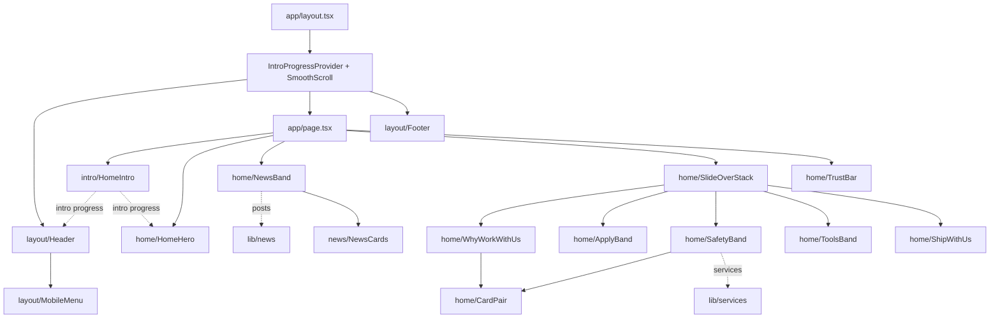

# NAVIGATION.md
> Map of the project: task → file, and every component in the library. Look here before searching the repo cold.

## Pages
| Route | File | Status |
|---|---|---|
| `/` | `app/page.tsx` | Forest drone hero (shows straight away — a short header-logo fade-in is all that plays on load), safety band (the services pair, the numbers band, then the road pair, since 2026-10-05), Ship with us band (full screen on black since 2026-10-02: a big Get a quote button that opens into the quote form, over the dot map), the story band (on white since 2026-10-02) and Why work with us (two shop rows under the heading — lease to own and new equipment, then maintenance and our shop — then the three job cards and their reasons), then the black Apply now band, full screen, since 2026-10-05, built. A news block sits between the story band and Why work with us (2026-10-07: the three newest posts as a row of picture cards that open one at a time, like the job cards; unconfirmed draft posts, hidden in production until the owner confirms them) |
| `/services` | `app/services/page.tsx` | The inner pages' opening, one big card with a service on it and the three as smaller cards under it that go up to the stage when chosen (`PictureStage`), "How we run it" as numbers and two lines with a picture under each, and a black closing band with one card cut on a slant, Get a quote on white beside the homepage's live dot map (`QuoteCard`; since 2026-10-08) |
| `/quote` | `app/quote/page.tsx` | Redirects to `/#quote` — the quote form lives in the homepage's Ship with us band since 2026-10-02 |
| `/fleet-map` | `app/fleet-map/page.tsx` | A real street map (MapLibre + OpenFreeMap) with the trucks as dots and counted circles, the truck count and the time read above it; sample trucks from a stub until the Samsara feed exists |
| `/news` | `app/news/page.tsx` | The shared opening without a lede, then the three newest posts on the Services page's stage (`PictureStage` with `headlines`; since 2026-10-09): one big with its picture and its day, headline and sentence on a white panel in the picture's corner, the three as smaller cards under it; every older post is a line of the list under that, "Earlier", with no picture (`NewsRow`; how many on the stage: `STAGED` in the page); a hairline closes it over the footer. Unconfirmed draft posts only for now, so a production build shows the "being built" placeholder |
| `/careers` | `app/careers/page.tsx` | The careers page: the three jobs, what each is and why to take it, each with its own Apply now (an underlined arrow link since 2026-10-07, `RiseLabel` and `FlyArrow`). Where Careers goes |
| `/careers/apply` | `app/careers/apply/page.tsx` | The job application with no job set, so it asks "Which job?" as its fifth question, after the contact ones. Where every Apply now outside the careers page goes (since 2026-10-05) |
| `/careers/drivers` | `app/careers/drivers/page.tsx` | The job application, opened on the driver job (the careers page's driver Apply now); sends to a stub until the backend exists |
| `/careers/staff` | `app/careers/staff/page.tsx` | The same application, opened on the office job, or the shop job with `?job=shop` |
| `/about` | `app/about/page.tsx` | The opening on white (the homepage story band's heading as the h1 — `StoryHeadline` centred, in Geist, "rule" in orange — and the lede) then the story down one line (`components/about/StoryLine.tsx`: a line drawn as you scroll, a dot per stop, a wide picture frame for each chapter with its words in a narrow column on the other side, sides swapping per chapter and the line bending across between them; from `lg` a chapter shows one stop at a time, and as it passes the middle of the screen the next stop's words and picture take the place of the last one's in the same frame, the current dot orange, a chapter's dots sharing the picture's height evenly from its top so the second of two is half way down, beside the words; nothing stands still since 2026-10-06, the page scrolls at its own speed (`READING_LINE`, `MIN_TRAVEL`, `TOP_FLOOR` set where the changes come); below `lg` the line runs straight down the left edge with every stop listed, its picture over its words; every second chapter is on a full-width black band (`onBlack`); stops in `lib/story.ts` → `timeline`, and a stop opens a new chapter when its `image` isn't `inPlace`), and the two cards, Shippers and Careers (`components/about/SplitCard.tsx`: each cut on a slant, white above and black below, the underlined arrow link under the words on the white, the black wedge a road with a dashed lane line rolling toward you; speed in `app/globals.css` → `road-drive`), on a full-width black band as tall as the cards (2026-10-07), on whose top edge the story's line lands in a last dot (`landing`). `StoryChapters.tsx` (the pinned route) and the sideways `Timeline.tsx` are no longer used |

## Common tasks
| I need to... | Go to |
|---|---|
| Change a nav link or the company name | `lib/site.ts` — Header, mobile menu and Footer all read from it |
| Change brand colors or the animation easing | `app/globals.css` → `@theme` (keep ARCHITECTURE.md in sync) |
| Change the space above and below homepage sections | `components/ui/spacing.ts` (`sectionY` / `sectionTop` / `sectionBottom`, `chapterY` / `chapterTop`) — see ARCHITECTURE.md → Section spacing |
| Change the page margins or the column grid | `components/ui/Container.tsx`, `components/ui/Columns.tsx`, `--breakpoint-desktop` / `--width-header-cta` in `app/globals.css` — see ARCHITECTURE.md → Layout grid |
| Change the font | `app/layout.tsx` → `Geist` (body, feeds `--font-sans` in `app/globals.css`) and `Archivo` (headlines, feeds the `font-display` utility in `app/globals.css`, where its width is set) |
| Change page titles / SEO description | `app/layout.tsx` → `metadata`, or `metadata` in each page file |
| Tune the homepage opening (when it starts on the truck, how far the header and hero text drop, when the headline lights up) | `components/intro/timeline.ts` |
| Change the header's links or their order (the phone menu follows) | `lib/site.ts` → `primaryNav` |
| Change which homepage section fills the line under a header item | The section's `data-nav-section` (its nav link's href; empty for none) in `components/home/SafetyBand.tsx`, `ShipWithUs.tsx`, `StoryTeaser.tsx`, `NewsBand.tsx` and `app/page.tsx` (Careers). The line itself: `components/layout/Header.tsx` → `SectionMark`, `READING_LINE` |
| Change how the header logo fades/settles in | `components/layout/Header.tsx` → `logoOpacity`, `logoScale` |
| Change how Ship with us slides over the safety band, or the Apply band over Why work with us (sheet height, pin, shadow) | `components/home/SlideOverStack.tsx` — `OVER_SHARE`; both wired in `app/page.tsx` |
| Change the homepage's black Apply now band (label, question, the pill, the dot road) | Copy: `lib/site.ts` → `applyBand` (the pill's words and link are `applyLink`); layout and the road (`ApplyRoad`): `components/home/ApplyBand.tsx` |
| Add, change or approve a news post (homepage block and `/news`) | `lib/news.ts` → `newsPosts` (remove `draft` once the owner has approved a post); layouts: `components/home/NewsBand.tsx`, `app/news/page.tsx`; the news page's stage: `components/ui/PictureStage.tsx`; its list and the homepage's cards: `components/news/` |
| Change the story band → About opening animation | Names: `lib/story.ts` → `STORY_BAND` / `STORY_OPEN`; the two `<ViewTransition>`s in `components/home/StoryTeaser.tsx` and `app/about/page.tsx`; timing in `app/globals.css` → `.story-open` |
| Change the Services card → quote screen animation | Names: `lib/site.ts` → `QUOTE_BAND` / `QUOTE_OPEN`; the two `<ViewTransition>`s in `components/services/QuoteCard.tsx` and `components/home/ShipWithUs.tsx`; timing in `app/globals.css` → `.quote-open` |
| Change the Ship with us band (copy, the quote form, the landing pause) | `components/home/ShipWithUs.tsx` — full screen, heading and button centred; the one-time landing pause is `useLandingPause` (`HOLD_MS`, the `itr-ship-landed` session flag); every Get a quote link gliding here and opening the form is `useQuoteLinks` (the link itself: `lib/site.ts` → `quoteLink`, `/#quote`). The button, form, checks and receipt are `components/home/QuoteBar.tsx`; the map, pins, route ride and white wave `components/home/ShipRouteMap.tsx` (wave timing: `app/globals.css` → `ship-wave`) |
| Change the Ship with us button and form's grey | `app/globals.css` → `--color-cloud` |
| Change the Services page's words or pictures | `lib/services.ts` → `services` (`detail`, `image`: the stage and its cards) and `servicesPage` (headline, lede, "How we run it" with its lines and each line's `picture`, the close); layout: `app/services/page.tsx` |
| Change how the stage on Services and News behaves (how long an item holds it, the growing card, what phones get) | `components/ui/PictureStage.tsx` → `CYCLE`, `choose`; the fill and the grow: `app/globals.css` → `service-fill`, `service-stage` |
| Change the safety band's services (the first pair, its words and the list of services) | `lib/services.ts` → `services` (the list) and `servicesGroup` (heading, paragraph, the two stills and their names); layout: `components/home/SafetyBand.tsx` |
| Change the safety band (GPS, dash cams) | Copy: `lib/site.ts` → `safetySystems` (GPS and dash cams), `safetyGroups` (the road pair's words and which cards pair up; the shop cards and words are `equipmentGroups`, shown in Why work with us), `safetyPitch` (the line beside the heading); layout: `components/home/SafetyBand.tsx`; each card's clip is its `video` in `safetySystems` (or an `image` still) (placeholders in `public/videos/safety-*-placeholder.mp4`) |
| Change the logo row under the safety band (Samsara, Fleetio, Volvo, Datatruck, OnRamp) | List and each logo's display height: `lib/site.ts` → `tools`; logo files: `public/logos/*.svg`; layout: `components/home/ToolsBand.tsx` |
| Edit the homepage headline (h1) | `lib/site.ts` → `heroLines`; the word-by-word light-up in `components/home/HeroHeadline.tsx`; placement in `components/home/HomeHero.tsx` |
| Change the hero video, its crop, its scrims or the pause between truck passes (`EMPTY_ROAD_MS`) | `components/home/HomeHero.tsx` (video `public/videos/home-hero-forest.mp4`, poster `public/images/home-hero-forest.jpg`); the h1 is `lib/site.ts` → `homeHeadline` |
| Change the homepage's Why work with us (heading, each job's four reasons, the order of the job cards and which starts open, the two shop rows over the job cards) | `lib/site.ts` → `whyWorkWithUs` (`order` and `open` for the cards), and `equipmentGroups` for the shop rows' cards and words (a card with no `video` or `image` shows as a grey stand-in); layout in `components/home/WhyWorkWithUs.tsx`; the sliding pair itself is `components/home/CardPair.tsx` |
| Change the three job cards (roles, job names, lines, photos) | `lib/site.ts` → `applyRoutes` (shared with the careers page and the application); photos in `public/images/apply-*.jpg` |
| Bring back the full-width homepage photo band, or add the B-roll video | `components/ui/HeroMedia.tsx` is still there but unused since 2026-09-17 — the apply cards took its place in `app/page.tsx` (they now sit in Why work with us) |
| Replace the draft company history (homepage card + About page) | `lib/story.ts` |
| Change the homepage numbers (years, miles, loads, states) | `lib/site.ts` → `companyStats`; layout in `components/home/TrustBar.tsx` |
| Change quote form fields, error messages or the thank-you screen | `components/home/QuoteBar.tsx` (the receipt is its thank-you) |
| Change the quote map's lit states, pins, route line or wave | `components/home/ShipRouteMap.tsx` |
| Connect the quote form to the backend | `lib/forms.ts` → `submitQuote` (keep `QuoteRequest` in sync) |
| Change the careers page's jobs, paragraphs or Why here points | `lib/site.ts` → `applyRoutes` (`title`, `summary`, `reasons`); layout in `components/careers/CareersOverview.tsx` |
| Change the job application's questions, answers, copy or thank-you screen | `components/careers/JobApplication.tsx` (the order and the questions per job are in `stepsFor`, which adds "Which job?" after the contact questions when the URL names no job and drops the driver's years after "Not yet"; what is sent is `JobApplication` in `lib/forms.ts`; the jobs' names, lines and photos come from `applyRoutes` in `lib/site.ts`, the line on the driver photo from `driverSlogans[0]`; the picture behind "Which job?" before a job is picked is `DEFAULT_IMAGE` in the same file, `public/images/apply-docks.jpg`) |
| Change the Fleet map (map style, zoom cap, dot and circle look) | `components/fleet/FleetMap.tsx` (`STYLE_URL`, `MAX_ZOOM`); page copy in `app/fleet-map/page.tsx` |
| Connect the Fleet map to Samsara | `lib/fleet.ts` → `getFleetSnapshot` (keep `FleetSnapshot` in sync) |
| Connect the job application to the backend | `lib/forms.ts` → `submitJobApplication` (keep `JobApplication` in sync) |
| Regenerate or re-project the state shapes | `scripts/build-us-states.mjs` → writes `lib/us-states.ts` |
| Fix a ZIP that lights up the wrong state | `lib/zip.ts` |
| Refresh the ZIP → city list (about once a year) | Download GeoNames' `US.zip`, then `node scripts/build-zip-cities.mjs path/to/US.txt` → `public/zip/*.json` |
| Change the shared input/select look | `components/ui/Field.tsx` → `controlClass` |
| Change header behavior (hide on scroll on phones, dimmed state during the logo moment) | `components/layout/Header.tsx` |
| Change the phone/tablet menu | `components/layout/MobileMenu.tsx` |
| Change the footer | `components/layout/Footer.tsx`; its links are `footerGroups` and the phone, address, USDOT and MC are `company`, both in `lib/site.ts` |
| Add or change a button style | `components/ui/Button.tsx` |
| Change a button or nav label, or the section label / heading style | Labels: `lib/site.ts` (`quoteLink`, `applyLink`, `careersLink`, `fleetMapLink`); styles: `components/ui/typography.ts`. Rules: DECISIONS.md → Wording and type |
| Fade a block in when it scrolls into view | Wrap it in `<Reveal>` from `components/ui` |
| Slide a photo and its text in from opposite sides, landing together | Make the section a `<SlideGroup>` and wrap each piece in `<SlideItem from="left" \| "right">` (`components/ui/SlideIn.tsx`); used by the safety band |
| Change the driver slogans | `lib/site.ts` → `driverSlogans` — `{ lead, tail }` pairs (ink over grey). Off the homepage since 2026-09-30; the first one captions the job application's driver photo |
| Start a new page | Copy a placeholder in `app/`, then add its link in `lib/site.ts` (check DECISIONS.md nav rules first) |
| Check whether something is in scope | `docs/DECISIONS.md` |
| Find the original logo files | `docs/Logo black.svg` (full logo), `docs/Only logo Solutions.svg` (icon only) |
| Run the site locally | `npm run dev` → http://localhost:3000 |

## How the homepage fits together

```mermaid
flowchart TD
  Layout["app/layout.tsx"] --> Providers["IntroProgressProvider + SmoothScroll"]
  Providers --> Header["layout/Header"]
  Providers --> Page["app/page.tsx"]
  Providers --> Footer["layout/Footer"]
  Header --> MobileMenu["layout/MobileMenu"]
  Page --> HomeIntro["intro/HomeIntro"]
  Page --> HomeHero["home/HomeHero"]
  SlideOverStack --> WhyWorkWithUs["home/WhyWorkWithUs"]
  SlideOverStack --> ApplyBand["home/ApplyBand"]
  Page --> NewsBand["home/NewsBand"]
  NewsBand -. "posts" .-> News["lib/news"]
  NewsBand --> NewsCards["news/NewsCards"]
  Page --> SlideOverStack["home/SlideOverStack"]
  SlideOverStack --> SafetyBand["home/SafetyBand"]
  SlideOverStack --> ToolsBand["home/ToolsBand"]
  SlideOverStack --> ShipWithUs["home/ShipWithUs"]
  SafetyBand --> CardPair["home/CardPair"]
  SafetyBand -. "services" .-> Services["lib/services"]
  WhyWorkWithUs --> CardPair
  Page --> TrustBar["home/TrustBar"]
  HomeIntro -. "intro progress" .-> Header
  HomeIntro -. "intro progress" .-> HomeHero
```

## Component library
Import from the folder, e.g. `import { Button, Container } from "@/components/ui"`.

| Folder | Component | What it does | Runs on |
|---|---|---|---|
| `ui/` | `Button` | Pill button; `href` makes it a link. Variants: `primary` (solid black), `outline` (black ring on a light frosted fill). Both share one type size so a pair sized alike matches. Sizes: `md`, `lg` | Server |
| `ui/` | `InteractiveHoverButton` | Pill whose label slides out on hover while an ink dot grows to fill it and brings the label back in white with an arrow; `href` makes it a link; sizes `sm` (fixed 8rem), `lg` (Button's lg height, width from className) and `lgFit` (lg for a button as wide as its label, the dot a fixed 24px in: Get another quote, 2026-10-06); variants `solid` (white, fills ink), `ghostLight` (thin white ring, fills white), and the header's `ghostQuiet` (faint ring over dark bands) / `ghostDark` / `ink`; size `md` is the header's 40px pair. The hero's Get a quote and Apply now, and the header's pair | Server |
| `ui/` | `Container` | Full-width side-margin wrapper — phone/tablet padding below `desktop` (1200px), content caps at 1200px and centers above it | Server |
| `ui/` | `Columns` | The 12-column / 24px-gutter grid that sits inside a `Container` — size children with `col-span-*` | Server |
| `ui/` | `Logo` | Brand logo, `variant="full"` or `"icon"`; fills its wrapper's width | Server |
| `ui/` | `Reveal` | Fades + lifts children in once they scroll into view; `delay` for stagger | Client |
| `ui/` | `SlideGroup`, `SlideItem` | A section that slides its items in from the sides on one shared trigger, so they start and stop together; `distance="100%"` starts an item fully off the screen edge. Clips sideways overflow | Client |
| `ui/` | `LinkHover` | `RiseLabel` (underlined words that roll up to a copy) and `FlyArrow` (the ↗ that flies out and back in): the hover for the underlined arrow links — Get a quote (safety band) and Read our full story (story band); Apply now in Why work with us used it until 2026-10-05, when the black Apply band took over. Driven by the link's `group` hover and focus | Server |
| `ui/` | `HeroMedia` | Full-width photo or looping video band, 500px tall; shown straight with no overlay; `image` now, optional `video` later. **Not currently used** — the homepage apply cards replaced it on 2026-09-17; kept for other pages' heroes | Server |
| `ui/` | `CountUp` | Number that fills up from zero once it scrolls into view; `suffix` for "+" / "M+" | Client |
| `ui/` | `RotatingSlogan` | Rolls through `driverSlogans` like an odometer; `as` picks the tag; pauses on hover/focus and in a background tab; static under reduced motion. **Not currently used** — the homepage slogan line was removed 2026-09-30 | Client |
| `ui/` | `ScrollFillText` | A heading's words fill from 25% to full strength as it scrolls up the screen (scroll-linked; finished text for reduced motion). Put it inside the heading; one per screen at most — not used anywhere since 2026-10-01 | Client |
| `ui/` | `Field`, `controlClass`, `errorId` | Form field label + error message, and the shared input/select look | Server |
| `ui/` | `PageOpening` | A page's opening on white: centred headline that rises in (StoryHeadline) and the lede under it; careers, Fleet map, Services and News | Server |
| `ui/` | `PagePlaceholder` | Temporary body for pages not built yet: `PageOpening` and nothing under it | Server |
| `layout/` | `Header` | Fixed, type-only header: logo top-left, plain text links with a thin gliding line under the current page, Get a quote / Apply now as a same-width pair of interactive hover buttons. White with no bar over dark bands; a white bar with ink type fades in over light sections once scrolled. Careers is a plain link; hide-on-scroll on phones | Client |
| `layout/` | `MobileMenu`, `MenuToggle` | Full-screen menu below `lg` and its two-line → X button | Client |
| `layout/` | `Footer` | On white since 2026-10-05 (ink before): two groups of big links, contact, Get a quote (black) and Apply now (black ring), then logo, legal name, USDOT and MC | Server |
| `layout/` | `CopyrightYear` | The year in the footer's copyright line: the build's year (`built`) in the HTML, the browser's own once the page is running, so a site not rebuilt after New Year doesn't show last year | Client |
| `home/` | `HeroHeadline` | The homepage h1, "A fleet you can trust. A load you can see." (`heroLines`): all full white (since 2026-10-02), lighting up word by word as the intro hands over; fixed since 2026-10-02 (it rolled through four pairs before) | Server-safe (rendered inside the client `HomeHero`) |
| `home/` | `HomeHero` | Full-screen forest drone loop (road on the left fifth): shipper h1 (`HeroHeadline`) lighting up word by word, one supporting line, Get a quote (solid) and Apply now (thin white ring) side by side in a 28.75rem column under the headline from `lg` (2026-10-02) | Client |
| `home/` | `WhyWorkWithUs` | Why work with us, the careers half (its ask is `ApplyBand`, right under it): heading (centred, no label, since 2026-10-05); two shop rows (`CardPair`): Lease to own and New equipment (pictures left, words right), then Maintenance on record and Our shop (mirrored), since 2026-10-05 — the shop pair moved from the safety band on 2026-10-03; then the careers block, centred since 2026-10-05: "Why ___ stay." as a heading, the three job cards across the full width (dispatcher, driver in the middle and open first, technician; open on hover, focus or tap; pick the job, don't link), and the open job's four reasons in a row beneath with every sentence in view (its centred Apply now went to the Apply band on 2026-10-05). Copy and the cards' order from `whyWorkWithUs` (`order`, `open`) and `equipmentGroups`, cards from `applyRoutes` | Client |
| `home/` | `StoryHeadline` | The story band's two-line heading (also the safety band's since 2026-09-30, with "We know" lit white instead of an orange word), each line rising in from behind its edge (the second 0.15 s later), the first line at 55% white and the accent word (`lib/story.ts` → `headlineAccent`) turning orange after it lands. Once, on first view | Client |
| `home/` | `StoryRoute` | The story band's three marks (1, 70+, 48) as a route, centred in their columns from `lg`: the hairline draws stop to stop (and ends at the last stop) with a riding orange dot, each mark lights as it's reached, 48 counts up from 1. Once, on first view; stacked with the road down the left on phones. Marks and lines in `lib/story.ts` → `milestones` | Client |
| `home/` | `ShipRouteMap` | The dotted lower-48 map filling Ship with us (beside the words on phones): the typed ZIPs light their states and drop pins, a dashed arc joins them, an orange dot rides it on send, and a white wave sweeps the dots (paused off screen; none of it under reduced motion). Images `public/images/us-dots.svg`, with the country's edge in brighter dots, and its white mask `us-dots-mask.svg` (rebuild both: `node scripts/build-us-dots.mjs`; the edge's strength is `EDGE` there) | Client |
| `home/` | `QuoteBar` | The site's quote form (every Get a quote opens it): a big `cloud` Get a quote button that opens into the form (Pickup ZIP, Delivery ZIP, Pickup date, Name, Phone or email), checks it, sends it through `submitQuote` and turns into a receipt with Get another quote; Escape (only — never a click) closes it back into the button, keeping what was typed | Client |
| `home/` | `ShipWithUs` | The shipper half's closing ask, full screen on black since 2026-10-02: label and heading over the map, the quote button-and-form under them, and a one-time landing pause on the way down; between the safety band and the story. Replaced `AudienceSplit` / `AudiencePanel` on 2026-09-18 | Client |
| `home/` | `SafetyBand` | What we haul and how we watch it: the heading and pitch, the services pair (`CardPair`) beside its words, the list of services and Get a quote (`lib/services.ts`), the numbers band (`between`), then the road pair — GPS and dash cams — mirrored beside its words (since 2026-10-05); the shop pair moved to Why work with us on 2026-10-03; all on white since 2026-10-02 | Client |
| `home/` | `CardPair` | Two cards side by side that open up (hover widens one and plays its clip, paused otherwise; a tap plays or pauses), on 7 of 12 columns from `lg`; `usePairVideos` keeps one clip playing per section. Takes any two cards (`PairCard`; a still can set its `position`; a card with neither clip nor still is a plain grey stand-in); used by the safety band's services and road pairs and Why work with us's two shop rows | Client |
| `home/` | `ToolsBand` | The five tool companies' logos, centred (no line over them since 2026-10-02), closing the safety band inside the same pinned section | Server |
| `home/` | `ApplyBand` | The careers half's closing ask, the twin of Ship with us (2026-10-05): a full black screen with a label, a 72px question and one Apply now pill (a link to the application, `/careers/apply`), over a road drawn in the map's dots on a canvas (`ApplyRoad`, moving only while on screen, still under reduced motion). Last on the page, straight on the white footer; slides up over Why work with us | Client (canvas) |
| `home/` | `NewsBand` | The news block between the story band and Why work with us: no heading shown (since 2026-10-09), the three newest posts as `NewsCards`, the All news link centred under them; renders nothing when there are no posts to show | Server |
| `news/` | `NewsRow` | One post as a line of the news page's "Earlier" list: day, headline, sentence | Server |
| `services/` | `QuoteCard` | The Services page's closing card: cut on a slant, the question and Get a quote on white, the homepage band's live map (`ShipRouteMap`) on black; no cut below laptop width. Its Get a quote grows the card into the homepage's quote band | Client |
| `ui/` | `PictureStage` | The stage on Services and News: one big card with an item's picture and its words on a white panel in the picture's corner, the items as smaller cards under it; choosing one grows it into the stage (a view transition), and with a mouse from laptop width it moves on every five seconds while a line fills, held while pointed at. Takes `items` (`StageItem`: name, words, an optional label and picture); `headlines` for names that are sentences (news posts) | Client |
| `news/` | `NewsCards` | The homepage news block's three posts: from 1024px a row of pictures, one open with the day, headline and sentence beside it on white; hover, focus or press another picture and the words trade places. Below 1024px stacked, all open | Client |
| `home/` | `SlideOverStack` | Pins the safety band from `lg` while Ship with us slides up over it as a sheet (70% of the band's height), once, on the way down; used a second time for the Apply band over Why work with us; `useCovered()` tells the band when it's covered so its timer pauses (2026-09-24) | Client (scroll) |
| `home/` | `TrustBar` | Company numbers that fill up on scroll, set on white with no box or lines, inside the safety band, between the services pair and the road pair (`companyStats` in `lib/site.ts`, `main` marks the two big ones); one centred row from `lg`, big pair over the small three below it | Server |
| `careers/` | `JobApplication` | One application for all three jobs, as a dark split: the picked job's photo on the left half (a band on phones), one question at a time on ink on the right under "Applying for" and the job's title, the picture changing with the question where one is set (`STEP_IMAGES`), always opening on the name; where the URL doesn't say the job (`/careers/apply`, against `/careers/drivers` and `/careers/staff?job=office|shop`) "Which job?", three photo cards, is the fifth question, over a picture of loading docks until then; Back from the first question goes to `/careers`. Tap answers move on, Enter goes on, number keys pick. Sent: a 122px icon plays in the middle of the panel (a ring draws, a tick draws in it, a white disc fills it, the tick turns into a T), then that T travels to the spot of the T of "Thanks" and becomes the letter (`SentMark`, sized by `T_GLYPH`), and the rest of the thanks comes in | Client |
| `careers/` | `CareersOverview` | The careers page: a dark opening, then one alternating photo-and-text section per job (paragraph, Why here list, Apply now into the application on that job) | Server |
| `intro/` | `HomeIntro` | Renders nothing; on load drives the shared intro progress 0 → 1 off the hero video's clock, which slides the header down with the truck, brings the hero text down after it and lights up the headline | Client |
| `intro/` | `timeline.ts` | `INTRO` video times, drop spans and distances, appear scale and the fraction things light up at | — |
| `providers/` | `IntroProgressProvider`, `useIntroProgress` | Shares intro progress (0–1) between `HomeIntro`, `Header` and `HomeHero` | Client |
| `providers/` | `SmoothScroll` | Lenis smooth scrolling; off for reduced motion | Client |

## Directory map
```
app/          → routes, one folder per page (App Router), globals.css, icon.svg
components/   → the component library (ui, layout, home, about, quote, intro, providers)
lib/          → site config (names + links), story copy, quote types + stub, state shapes, ZIP lookup
scripts/      → one-off generators (state shapes for the quote map)
public/       → logo.svg, logo-icon.svg
docs/         → project docs + original logo files
```
