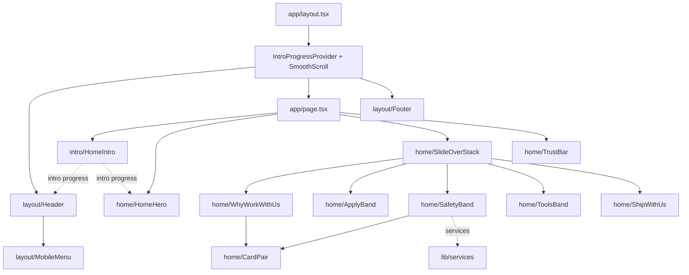

# NAVIGATION.md
> Map of the project: task → file, and every component in the library. Look here before searching the repo cold.

## Pages
| Route | File | Status |
|---|---|---|
| `/` | `app/page.tsx` | Forest drone hero (shows straight away — a short header-logo fade-in is all that plays on load), safety band (the services pair, the numbers band, then the road pair, since 2026-10-05), Ship with us band (full screen on black since 2026-10-02: a big Get a quote button that opens into the quote form, over the dot map), the story band (on white since 2026-10-02) and Why work with us (two shop rows under the heading — lease to own and new equipment, then maintenance and our shop — then the three job cards and their reasons), then the black Apply now band, full screen, since 2026-10-05, built |
| `/services` | `app/services/page.tsx` | Placeholder |
| `/quote` | `app/quote/page.tsx` | Redirects to `/#quote` — the quote form lives in the homepage's Ship with us band since 2026-10-02 |
| `/fleet-map` | `app/fleet-map/page.tsx` | Placeholder (Fleet Map — formerly Track a Load) |
| `/news` | `app/news/page.tsx` | Placeholder |
| `/careers` | `app/careers/page.tsx` | The careers page: the three jobs, what each is and why to take it, each with its own Apply now. Where Careers and every other Apply now go |
| `/careers/drivers` | `app/careers/drivers/page.tsx` | The job application, opened on the driver job (the careers page's driver Apply now); sends to a stub until the backend exists |
| `/careers/staff` | `app/careers/staff/page.tsx` | The same application, opened on the office job, or the shop job with `?job=shop` |
| `/about` | `app/about/page.tsx` | Opening "B": the dark band (safety band look, `HalfStar`, `StoryHeadline` as the h1) with one picture across the edge into white and the short story beside it; then the sideways timeline (`components/about/Timeline.tsx` — pinned and scroll-driven from `lg`, a swipe row below) and the two cards (draft copy in `lib/story.ts`) |

## Common tasks
| I need to... | Go to |
|---|---|
| Change a nav link or the company name | `lib/site.ts` — Header, mobile menu and Footer all read from it |
| Change brand colors or the animation easing | `app/globals.css` → `@theme` (keep ARCHITECTURE.md in sync) |
| Change the space above and below homepage sections | `components/ui/spacing.ts` (`sectionY` / `sectionTop` / `sectionBottom`, `chapterY` / `chapterTop`) — see ARCHITECTURE.md → Section spacing |
| Change the page margins or the column grid | `components/ui/Container.tsx`, `components/ui/Columns.tsx`, `--breakpoint-desktop` / `--width-header-cta` in `app/globals.css` — see ARCHITECTURE.md → Layout grid |
| Change the font | `app/layout.tsx` → `Geist` (body, feeds `--font-sans` in `app/globals.css`) and `Archivo` (headlines, feeds the `font-display` utility in `app/globals.css`, where its width is set) |
| Change page titles / SEO description | `app/layout.tsx` → `metadata`, or `metadata` in each page file |
| Tune the homepage opening (when it starts on the truck, how far the header and hero text drop, when the headline lights up) | `components/intro/timeline.ts` |
| Change how the header logo fades/settles in | `components/layout/Header.tsx` → `logoOpacity`, `logoScale` |
| Change how Ship with us slides over the safety band, or the Apply band over Why work with us (sheet height, pin, shadow) | `components/home/SlideOverStack.tsx` — `OVER_SHARE`; both wired in `app/page.tsx` |
| Change the homepage's black Apply now band (label, question, the pill, the dot road) | Copy: `lib/site.ts` → `applyBand` (the pill's words and link are `applyLink`); layout and the road (`ApplyRoad`): `components/home/ApplyBand.tsx` |
| Change the story band → About opening animation | Names: `lib/story.ts` → `STORY_BAND` / `STORY_OPEN`; the two `<ViewTransition>`s in `components/home/StoryTeaser.tsx` and `app/about/page.tsx`; timing in `app/globals.css` → `.story-open` |
| Change the Ship with us band (copy, the quote form, the landing pause) | `components/home/ShipWithUs.tsx` — full screen, heading and button centred; the one-time landing pause is `useLandingPause` (`HOLD_MS`, the `itr-ship-landed` session flag); every Get a quote link gliding here and opening the form is `useQuoteLinks` (the link itself: `lib/site.ts` → `quoteLink`, `/#quote`). The button, form, checks and receipt are `components/home/QuoteBar.tsx`; the map, pins, route ride and white wave `components/home/ShipRouteMap.tsx` (wave timing: `app/globals.css` → `ship-wave`) |
| Change the Ship with us button and form's grey | `app/globals.css` → `--color-cloud` |
| Change the safety band's services (the first pair, its words and the list of services) | `lib/services.ts` → `services` (the list) and `servicesGroup` (heading, paragraph, the two stills and their names); layout: `components/home/SafetyBand.tsx` |
| Change the safety band (GPS, dash cams) | Copy: `lib/site.ts` → `safetySystems` (GPS and dash cams), `safetyGroups` (the road pair's words and which cards pair up; the shop cards and words are `equipmentGroups`, shown in Why work with us), `safetyPitch` (the line beside the heading); layout: `components/home/SafetyBand.tsx`; each card's clip is its `video` in `safetySystems` (or an `image` still) (placeholders in `public/videos/safety-*-placeholder.mp4`) |
| Change the logo row under the safety band (Samsara, Fleetio, Volvo, Datatruck, OnRamp) | List and each logo's display height: `lib/site.ts` → `tools`; logo files: `public/logos/*.svg`; layout: `components/home/ToolsBand.tsx` |
| Edit the homepage headline (h1) | `lib/site.ts` → `heroLines`; the word-by-word light-up in `components/home/HeroHeadline.tsx`; placement in `components/home/HomeHero.tsx` |
| Change the hero video, its crop, its scrims or the pause between truck passes (`EMPTY_ROAD_MS`) | `components/home/HomeHero.tsx` (video `public/videos/home-hero-forest.mp4`, poster `public/images/home-hero-forest.jpg`); the h1 is `lib/site.ts` → `homeHeadline` |
| Change the homepage's Why work with us (heading, each job's five reasons, the order of the job cards and which starts open, the two shop rows over the job cards) | `lib/site.ts` → `whyWorkWithUs` (`order` and `open` for the cards), and `equipmentGroups` for the shop rows' cards and words (a card with no `video` or `image` shows as a grey stand-in); layout in `components/home/WhyWorkWithUs.tsx`; the sliding pair itself is `components/home/CardPair.tsx` |
| Change the three job cards (roles, job names, lines, photos) | `lib/site.ts` → `applyRoutes` (shared with the careers page and the application); photos in `public/images/apply-*.jpg` |
| Bring back the full-width homepage photo band, or add the B-roll video | `components/ui/HeroMedia.tsx` is still there but unused since 2026-09-17 — the apply cards took its place in `app/page.tsx` (they now sit in Why work with us) |
| Replace the draft company history (homepage card + About page) | `lib/story.ts` |
| Change the homepage numbers (years, miles, loads, states) | `lib/site.ts` → `companyStats`; layout in `components/home/TrustBar.tsx` |
| Change quote form fields, error messages or the thank-you screen | `components/home/QuoteBar.tsx` (the receipt is its thank-you) |
| Change the quote map's lit states, pins, route line or wave | `components/home/ShipRouteMap.tsx` |
| Connect the quote form to the backend | `lib/forms.ts` → `submitQuote` (keep `QuoteRequest` in sync) |
| Change the careers page's jobs, paragraphs or Why here points | `lib/site.ts` → `applyRoutes` (`title`, `summary`, `reasons`); layout in `components/careers/CareersOverview.tsx` |
| Change the job application's questions, answers, copy or thank-you screen | `components/careers/JobApplication.tsx` (questions per job in `stepsFor`; the jobs' names, lines and photos come from `applyRoutes` in `lib/site.ts`, the line on the driver photo from `driverSlogans[0]`) |
| Connect the job application to the backend | `lib/forms.ts` → `submitJobApplication` (keep `JobApplication` in sync) |
| Regenerate or re-project the state shapes | `scripts/build-us-states.mjs` → writes `lib/us-states.ts` |
| Fix a ZIP that lights up the wrong state | `lib/zip.ts` |
| Change the shared input/select look | `components/ui/Field.tsx` → `controlClass` |
| Change header behavior (hide on scroll on phones, dimmed state during the logo moment) | `components/layout/Header.tsx` |
| Change the phone/tablet menu | `components/layout/MobileMenu.tsx` |
| Change the footer | `components/layout/Footer.tsx`; its links are `footerGroups` and the phone, address, USDOT and MC are `company`, both in `lib/site.ts` |
| Add or change a button style | `components/ui/Button.tsx` |
| Change a button or nav label, or the section label / heading style | Labels: `lib/site.ts` (`quoteLink`, `applyLink`, `careersLink`, `fleetMapLink`); styles: `components/ui/typography.ts`. Rules: DECISIONS.md → Wording and type |
| Fade a block in when it scrolls into view | Wrap it in `<Reveal>` from `components/ui` |
| Slide a photo and its text in from opposite sides, landing together | Make the section a `<SlideGroup>` and wrap each piece in `<SlideItem from="left" \| "right">` (`components/ui/SlideIn.tsx`); used by the safety band |
| Change the driver slogans | `lib/site.ts` → `driverSlogans` — `{ lead, tail }` pairs (ink over grey). Off the homepage since 2026-09-30; the first one captions the job application's driver photo |
| Start a new page | Copy a placeholder in `app/`, then add its link in `lib/site.ts` (check DECISIONS.md nav rules first) |
| Check whether something is in scope | `docs/DECISIONS.md` |
| Find the original logo files | `docs/Logo black.svg` (full logo), `docs/Only logo Solutions.svg` (icon only) |
| Run the site locally | `npm run dev` → http://localhost:3000 |

## How the homepage fits together

```mermaid
flowchart TD
  Layout["app/layout.tsx"] --> Providers["IntroProgressProvider + SmoothScroll"]
  Providers --> Header["layout/Header"]
  Providers --> Page["app/page.tsx"]
  Providers --> Footer["layout/Footer"]
  Header --> MobileMenu["layout/MobileMenu"]
  Page --> HomeIntro["intro/HomeIntro"]
  Page --> HomeHero["home/HomeHero"]
  SlideOverStack --> WhyWorkWithUs["home/WhyWorkWithUs"]
  SlideOverStack --> ApplyBand["home/ApplyBand"]
  Page --> SlideOverStack["home/SlideOverStack"]
  SlideOverStack --> SafetyBand["home/SafetyBand"]
  SlideOverStack --> ToolsBand["home/ToolsBand"]
  SlideOverStack --> ShipWithUs["home/ShipWithUs"]
  SafetyBand --> CardPair["home/CardPair"]
  SafetyBand -. "services" .-> Services["lib/services"]
  WhyWorkWithUs --> CardPair
  Page --> TrustBar["home/TrustBar"]
  HomeIntro -. "intro progress" .-> Header
  HomeIntro -. "intro progress" .-> HomeHero
```

## Component library
Import from the folder, e.g. `import { Button, Container } from "@/components/ui"`.

| Folder | Component | What it does | Runs on |
|---|---|---|---|
| `ui/` | `Button` | Pill button; `href` makes it a link. Variants: `primary` (solid black), `outline` (black ring on a light frosted fill). Both share one type size so a pair sized alike matches. Sizes: `md`, `lg` | Server |
| `ui/` | `InteractiveHoverButton` | Pill whose label slides out on hover while an ink dot grows to fill it and brings the label back in white with an arrow; `href` makes it a link; sizes `sm` (fixed 8rem) and `lg` (Button's lg height, width from className); variants `solid` (white, fills ink), `ghostLight` (thin white ring, fills white), and the header's `ghostQuiet` (faint ring over dark bands) / `ghostDark` / `ink`; size `md` is the header's 40px pair. The hero's Get a quote and Apply now, and the header's pair | Server |
| `ui/` | `Container` | Full-width side-margin wrapper — phone/tablet padding below `desktop` (1200px), content caps at 1200px and centers above it | Server |
| `ui/` | `Columns` | The 12-column / 24px-gutter grid that sits inside a `Container` — size children with `col-span-*` | Server |
| `ui/` | `Logo` | Brand logo, `variant="full"` or `"icon"`; fills its wrapper's width | Server |
| `ui/` | `Reveal` | Fades + lifts children in once they scroll into view; `delay` for stagger | Client |
| `ui/` | `SlideGroup`, `SlideItem` | A section that slides its items in from the sides on one shared trigger, so they start and stop together; `distance="100%"` starts an item fully off the screen edge. Clips sideways overflow | Client |
| `ui/` | `LinkHover` | `RiseLabel` (underlined words that roll up to a copy) and `FlyArrow` (the ↗ that flies out and back in): the hover for the underlined arrow links — Get a quote (safety band) and Read our full story (story band); Apply now in Why work with us used it until 2026-10-05, when the black Apply band took over. Driven by the link's `group` hover and focus | Server |
| `ui/` | `HeroMedia` | Full-width photo or looping video band, 500px tall; shown straight with no overlay; `image` now, optional `video` later. **Not currently used** — the homepage apply cards replaced it on 2026-09-17; kept for other pages' heroes | Server |
| `ui/` | `CountUp` | Number that fills up from zero once it scrolls into view; `suffix` for "+" / "M+" | Client |
| `ui/` | `RotatingSlogan` | Rolls through `driverSlogans` like an odometer; `as` picks the tag; pauses on hover/focus and in a background tab; static under reduced motion. **Not currently used** — the homepage slogan line was removed 2026-09-30 | Client |
| `ui/` | `ScrollFillText` | A heading's words fill from 25% to full strength as it scrolls up the screen (scroll-linked; finished text for reduced motion). Put it inside the heading; one per screen at most — not used anywhere since 2026-10-01 | Client |
| `ui/` | `Field`, `controlClass`, `errorId` | Form field label + error message, and the shared input/select look | Server |
| `ui/` | `PagePlaceholder` | Temporary body for pages not built yet | Server |
| `layout/` | `Header` | Fixed, type-only header: logo top-left, plain text links with a thin gliding line under the current page, Get a quote / Apply now as a same-width pair of interactive hover buttons. White with no bar over dark bands; a white bar with ink type fades in over light sections once scrolled. Careers is a plain link; hide-on-scroll on phones | Client |
| `layout/` | `MobileMenu`, `MenuToggle` | Full-screen menu below `lg` and its two-line → X button | Client |
| `layout/` | `Footer` | Two groups of big links, contact, Get a quote and Apply now, then logo, legal name, USDOT and MC | Server |
| `home/` | `HeroHeadline` | The homepage h1, "A fleet you can trust. A load you can see." (`heroLines`): all full white (since 2026-10-02), lighting up word by word as the intro hands over; fixed since 2026-10-02 (it rolled through four pairs before) | Server-safe (rendered inside the client `HomeHero`) |
| `home/` | `HomeHero` | Full-screen forest drone loop (road on the left fifth): shipper h1 (`HeroHeadline`) lighting up word by word, one supporting line, Get a quote (solid) and Apply now (thin white ring) side by side in a 28.75rem column under the headline from `lg` (2026-10-02) | Client |
| `home/` | `WhyWorkWithUs` | Why work with us, the careers half (its ask is `ApplyBand`, right under it): heading (centred, no label, since 2026-10-05); two shop rows (`CardPair`): Lease to own and New equipment (pictures left, words right), then Maintenance on record and Our shop (mirrored), since 2026-10-05 — the shop pair moved from the safety band on 2026-10-03; then the careers block, centred since 2026-10-05: "Why ___ stay." as a heading, the three job cards across the full width (dispatcher, driver in the middle and open first, technician; open on hover, focus or tap; pick the job, don't link), and the open job's five reasons in a row beneath with every sentence in view (its centred Apply now went to the Apply band on 2026-10-05). Copy and the cards' order from `whyWorkWithUs` (`order`, `open`) and `equipmentGroups`, cards from `applyRoutes` | Client |
| `home/` | `StoryHeadline` | The story band's two-line heading (also the safety band's since 2026-09-30, with "We know" lit white instead of an orange word), each line rising in from behind its edge (the second 0.15 s later), the first line at 55% white and the accent word (`lib/story.ts` → `headlineAccent`) turning orange after it lands. Once, on first view | Client |
| `home/` | `StoryRoute` | The story band's three marks (1, 70+, 48) as a route, centred in their columns from `lg`: the hairline draws stop to stop (and ends at the last stop) with a riding orange dot, each mark lights as it's reached, 48 counts up from 1. Once, on first view; stacked with the road down the left on phones. Marks and lines in `lib/story.ts` → `milestones` | Client |
| `home/` | `ShipRouteMap` | The dotted lower-48 map filling Ship with us (beside the words on phones): the typed ZIPs light their states and drop pins, a dashed arc joins them, an orange dot rides it on send, and a white wave sweeps the dots (paused off screen; none of it under reduced motion). Images `public/images/us-dots.svg` and its white mask `us-dots-mask.svg` (rebuild both: `node scripts/build-us-dots.mjs`) | Client |
| `home/` | `QuoteBar` | The site's quote form (every Get a quote opens it): a big `cloud` Get a quote button that opens into the form (Pickup ZIP, Delivery ZIP, Pickup date, Name, Phone or email), checks it, sends it through `submitQuote` and turns into a receipt with Get another quote; Escape (only — never a click) closes it back into the button, keeping what was typed | Client |
| `home/` | `ShipWithUs` | The shipper half's closing ask, full screen on black since 2026-10-02: label and heading over the map, the quote button-and-form under them, and a one-time landing pause on the way down; between the safety band and the story. Replaced `AudienceSplit` / `AudiencePanel` on 2026-09-18 | Client |
| `home/` | `SafetyBand` | What we haul and how we watch it: the heading and pitch, the services pair (`CardPair`) beside its words, the list of services and Get a quote (`lib/services.ts`), the numbers band (`between`), then the road pair — GPS and dash cams — mirrored beside its words (since 2026-10-05); the shop pair moved to Why work with us on 2026-10-03; all on white since 2026-10-02 | Client |
| `home/` | `CardPair` | Two cards side by side that open up (hover widens one and plays its clip, paused otherwise; a tap plays or pauses), on 7 of 12 columns from `lg`; `usePairVideos` keeps one clip playing per section. Takes any two cards (`PairCard`; a still can set its `position`; a card with neither clip nor still is a plain grey stand-in); used by the safety band's services and road pairs and Why work with us's two shop rows | Client |
| `home/` | `ToolsBand` | The five tool companies' logos, centred (no line over them since 2026-10-02), closing the safety band inside the same pinned section | Server |
| `home/` | `ApplyBand` | The careers half's closing ask, the twin of Ship with us (2026-10-05): a full black screen with a label, a 72px question and one Apply now pill (a link to `/careers`), over a road drawn in the map's dots on a canvas (`ApplyRoad`, moving only while on screen, still under reduced motion). Last on the page, straight on the footer; slides up over Why work with us | Client (canvas) |
| `home/` | `SlideOverStack` | Pins the safety band from `lg` while Ship with us slides up over it as a sheet (70% of the band's height), once, on the way down; used a second time for the Apply band over Why work with us; `useCovered()` tells the band when it's covered so its timer pauses (2026-09-24) | Client (scroll) |
| `home/` | `TrustBar` | Company numbers that fill up on scroll, set on white with no box or lines, inside the safety band, between the services pair and the road pair (`companyStats` in `lib/site.ts`, `main` marks the two big ones); one centred row from `lg`, big pair over the small three below it | Server |
| `careers/` | `JobApplication` | One application for all three jobs, as a dark split: the picked job's photo on the left half (a band on phones), one question at a time on ink on the right under "Applying for" and the job's title, the picture changing with the question where one is set (`STEP_IMAGES`), opening on the name (the job comes from the URL: `/careers/drivers`, `/careers/staff?job=office|shop`); Back from there goes to `/careers`. Tap answers move on, Enter goes on, number keys pick | Client |
| `careers/` | `CareersOverview` | The careers page: a dark opening, then one alternating photo-and-text section per job (paragraph, Why here list, Apply now into the application on that job) | Server |
| `intro/` | `HomeIntro` | Renders nothing; on load drives the shared intro progress 0 → 1 off the hero video's clock, which slides the header down with the truck, brings the hero text down after it and lights up the headline | Client |
| `intro/` | `timeline.ts` | `INTRO` video times, drop spans and distances, appear scale and the fraction things light up at | — |
| `providers/` | `IntroProgressProvider`, `useIntroProgress` | Shares intro progress (0–1) between `HomeIntro`, `Header` and `HomeHero` | Client |
| `providers/` | `SmoothScroll` | Lenis smooth scrolling; off for reduced motion | Client |

## Directory map
```
app/          → routes, one folder per page (App Router), globals.css, icon.svg
components/   → the component library (ui, layout, home, about, quote, intro, providers)
lib/          → site config (names + links), story copy, quote types + stub, state shapes, ZIP lookup
scripts/      → one-off generators (state shapes for the quote map)
public/       → logo.svg, logo-icon.svg
docs/         → project docs + original logo files
```
